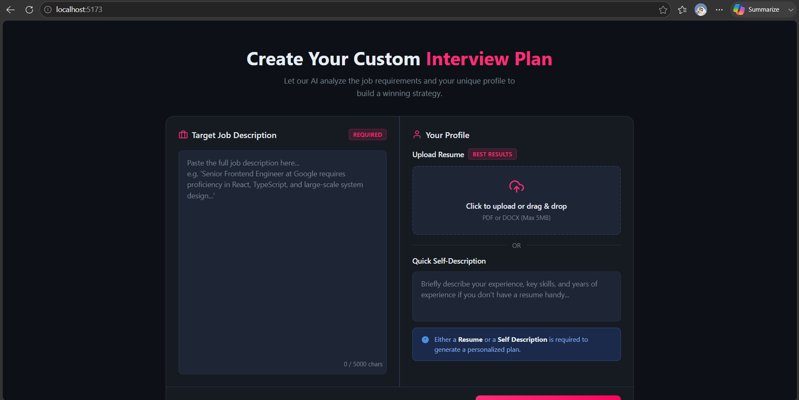
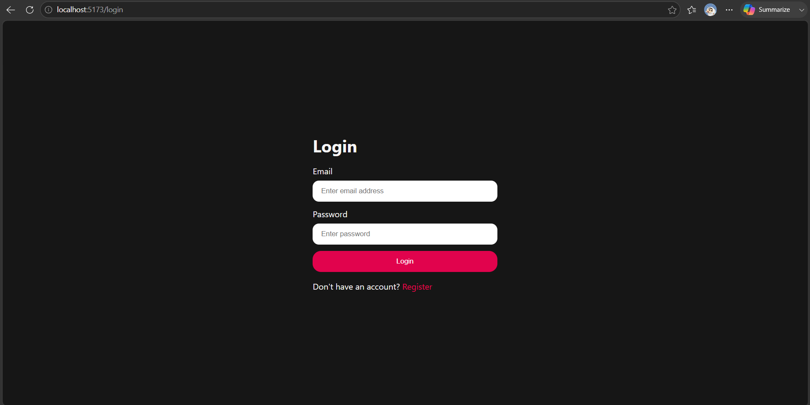
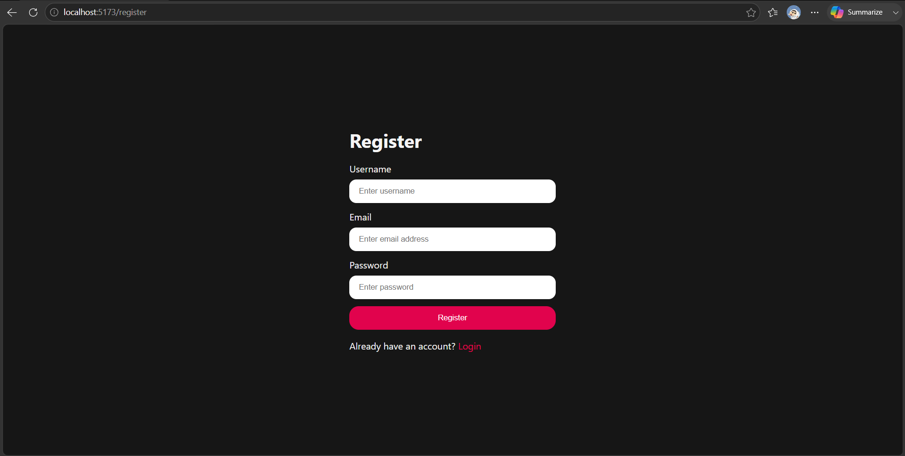
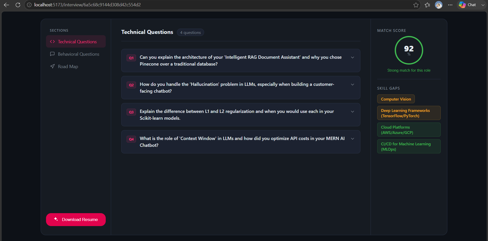
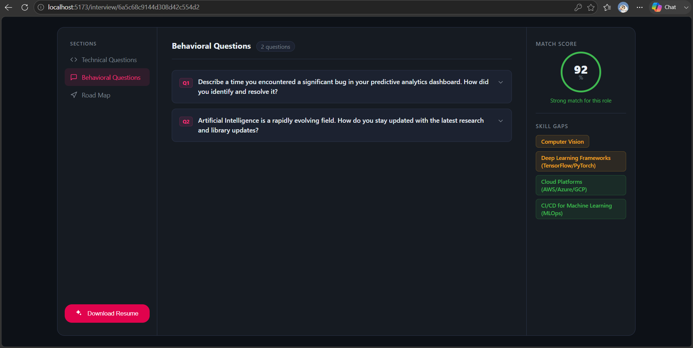
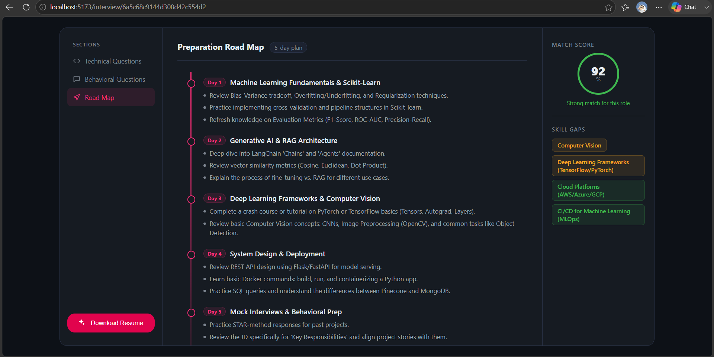

# 🤖 Interview AI

An AI-powered interview preparation platform that helps job seekers prepare for interviews by analyzing their resume and job description. The application generates personalized interview questions, identifies skill gaps, and provides a preparation roadmap using Google's Gemini AI.

---

## ✨ Features

- 🔐 User Authentication (Login & Register)
- 📄 Upload Resume (PDF)
- 💼 Add Job Description
- 🤖 AI-powered Interview Analysis
- 🎯 Resume & Job Description Match Analysis
- 💻 Technical Interview Questions
- 🧠 Behavioral Interview Questions
- 📈 Skill Gap Identification
- 🗺️ Personalized Preparation Roadmap
- 📱 Responsive User Interface

---

## 🛠️ Tech Stack

### Frontend
- React.js
- React Router
- SCSS
- Axios

### Backend
- Node.js
- Express.js
- MongoDB
- Mongoose
- Multer
- PDF Parse
- JWT Authentication

### AI
- Google Gemini API

---

## 📂 Project Structure

```
interview-ai
│
├── backend
│   ├── controllers
│   ├── middleware
│   ├── models
│   ├── routes
│   ├── services
│   ├── config
│   └── server.js
│
├── frontend
│   ├── src
│   ├── components
│   ├── hooks
│   ├── pages
│   ├── style
│   └── App.jsx
│
├── screenshots
│   ├── home.png
│   ├── login.png
│   ├── register.png
│   ├── technical_question.png
│   ├── behavioral_question.png
│   └── roadmap.png
│
└── README.md
```

---

## 🚀 Getting Started

### 1. Clone the Repository

```bash
git clone https://github.com/Sumit-Kumar-Panigrahi/interview-ai.git
```

### 2. Install Backend Dependencies

```bash
cd backend
npm install
```

### 3. Install Frontend Dependencies

```bash
cd ../frontend
npm install
```

### 4. Configure Environment Variables

Create a `.env` file inside the **backend** folder.

```env
PORT=3000

MONGO_URI=YOUR_MONGODB_URI

JWT_SECRET=YOUR_SECRET_KEY

GOOGLE_API_KEY=YOUR_GOOGLE_GEMINI_API_KEY

CLIENT_URL=http://localhost:5173
```

---

## ▶️ Run the Application

### Backend

```bash
cd backend
npm run dev
```

### Frontend

```bash
cd frontend
npm run dev
```

---

# 📸 Screenshots

## 🏠 Home Page



---

## 🔐 Login Page



---

## 📝 Register Page



---

## 💻 Technical Interview Questions



---

## 🧠 Behavioral Interview Questions



---

## 🗺️ Personalized Preparation Roadmap



---

## 🎯 Future Enhancements

- 🎤 AI Voice Interview
- 📄 Export Interview Report as PDF
- 📊 Interview History Dashboard
- ⭐ Resume Improvement Suggestions
- 🌙 Dark Mode
- 📧 Email Report Sharing

---

## 🤝 Contributing

Contributions are welcome!

1. Fork the repository
2. Create a new feature branch
3. Commit your changes
4. Push the branch
5. Open a Pull Request

---

## 👨‍💻 Author

**Sumit Kumar Panigrahi**

- GitHub: https://github.com/Sumit-Kumar-Panigrahi
- LinkedIn: *(Add your LinkedIn profile here)*

---

## ⭐ Support

If you found this project helpful, consider giving it a ⭐ on GitHub!